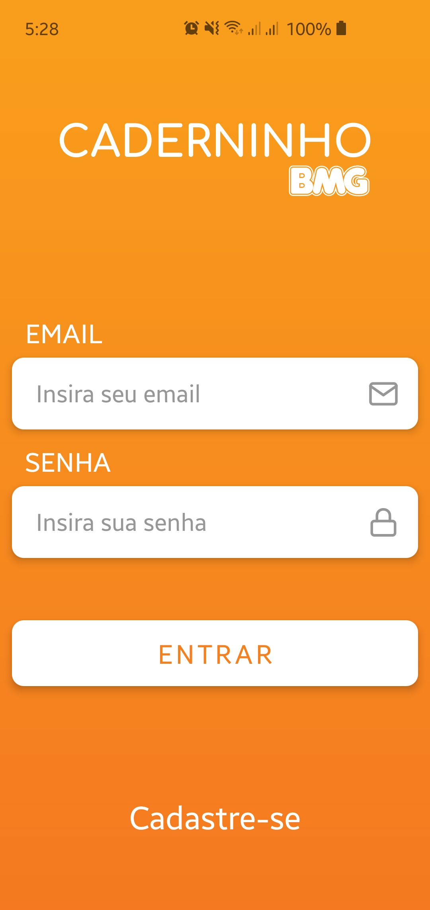
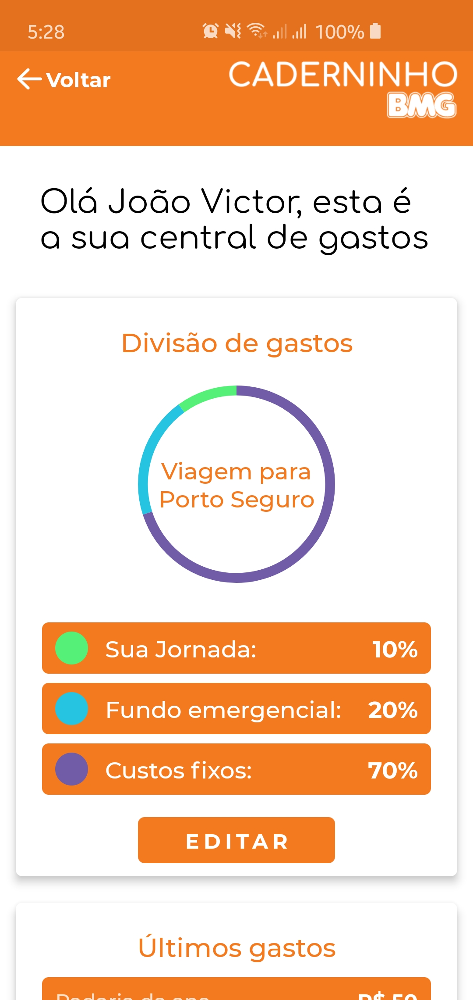
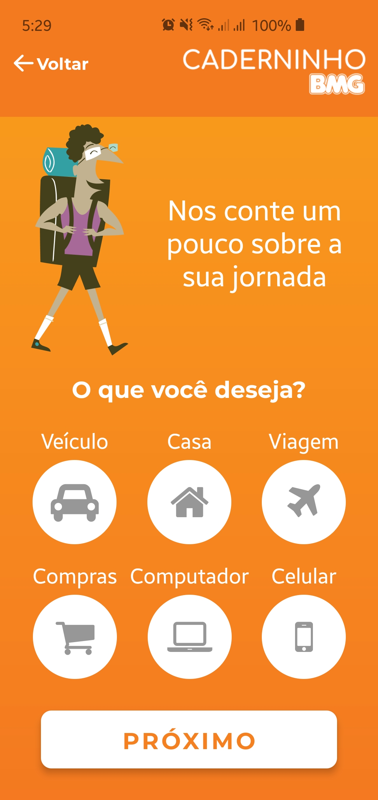
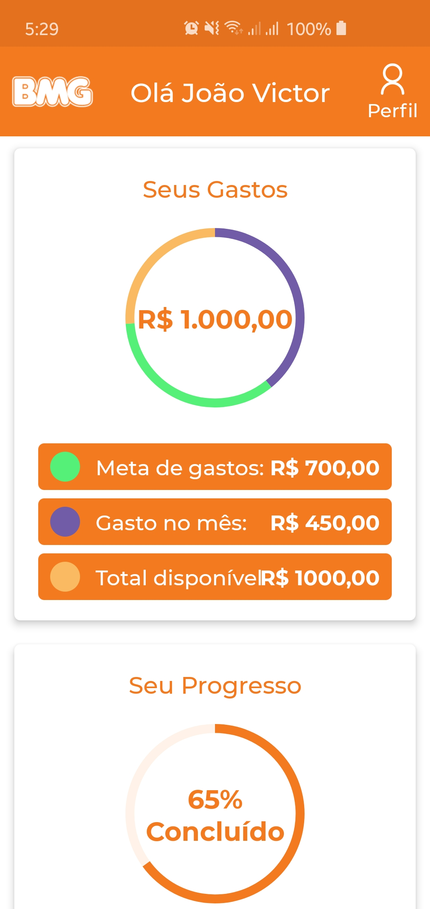

# Caderninho BMG
Projeto desenvolvido durante o Hackathon BMG no período de 30/05/2020 a 31/05/2020

### Tecnologias
- React Native
- GraphQL (API da BMG)
- Node
- MongoDB
  
### Screenshoots

                       

### Equipe
- João Victor Cabral (Desenvolvedor)
- Henrique Cotta (Desenvolvedor)
- Daniel Rodrigues (Desenvolvedor)
- Jonas Castro (Business)
- Miguel Arquimedes (UI/UX)
